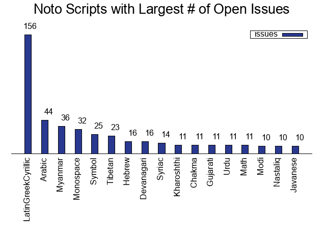
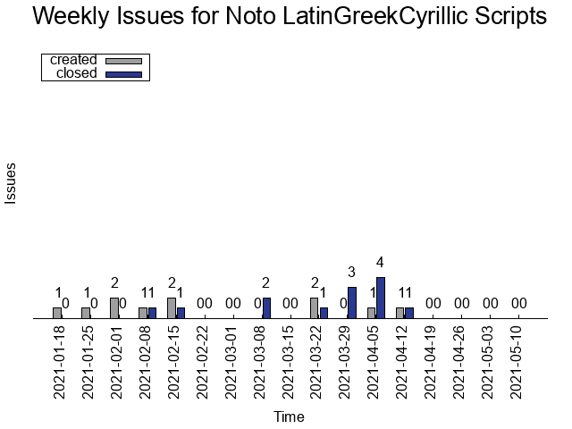
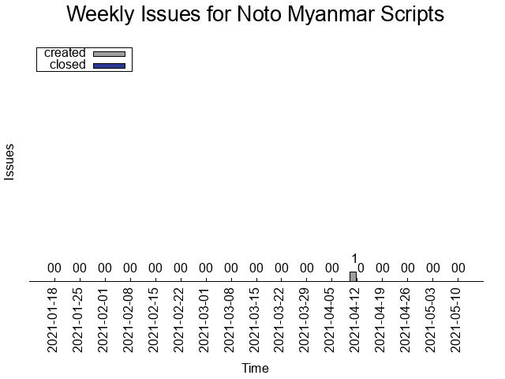
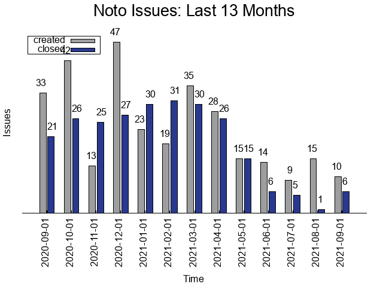
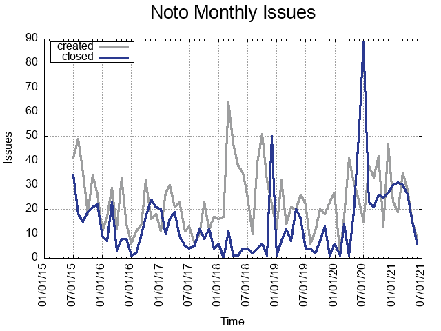

# Noto Fonts

Noto’s goal is to provide a beautiful reading experience for all languages. It is a free, professionally-designed, open-source collection of fonts with a harmonious look and feel in multiple weights and styles. All Noto fonts are published under the [SIL Open Font License (OFL) v1.1](http://scripts.sil.org/OFL), which allows you to copy, modify, and redistribute them if you need to.

For background, technical details, and how to contribute, see the [EN FAQ](FAQ.md) or [KR FAQ 자주 묻는 질문](FAQ-KR.md).

Have fun with Noto! — Google Fonts Team

## Usage Notes

If you want to use Noto on Windows, please download [hinted fonts](https://github.com/googlefonts/noto-fonts/tree/main/hinted/ttf) where available.

If you want to download this git repo to obtain copies of the latest fonts, use the following command with the `depth` option to avoid downloading gigabytes of historical version data you won't need:

    git clone git@github.com:googlefonts/noto-fonts.git --depth 1;

## Recent updates

#### 2021.06.03

*NotoNaskhArabic*: all of diacrritics now support Bold weight (and variable) replacing prior Regular only diacritics.
*NotoKufiArabic*: updated Kufi style to include some (not all :-)) codepoints listed in https://github.com/googlefonts/noto-fonts/issues/1870

#### 2021.04.20

The Noto fonts published on this date were built using the newest fontmake which resolved an issue impacting [Noto fonts on Windows](https://github.com/googlefonts/noto-fonts/issues/2066). The following applications are affected: MS Write, MS Word and MS Powerpoint.
Note that only fonts published on 2021.04.20 have this issue resolved. We are working on validating the other Noto fonts which will be published at a later date.

#### 2021.03.24

This is work in progress - we have published an update to Greek codepoints in NotoSans. Similar changes will arrive between now and end of 2021 to all Latin Greek Cyrillic Noto fonts. For changes please see [NotoSans update](https://github.com/googlefonts/noto-source/blob/main/WIP-GRK/20210310-NotoSans-MM.pdf). In other files in https://github.com/googlefonts/noto-source/blob/main/WIP-GRK/ you'll find various update details. The next update, to NotoSansDisplay will arive in early April.

#### 2021.02.28

We have recompiled all the existing sources with a new version of the fontmake compiler. The released fonts have the same version, and virtually are the same (but compilation date) as the fonts which were released previously. Therefore, there's no need to update anything if you track the fonts in this repository.

## Noto Issues

When you, a user, create Noto issues for every problem that you encounter using Noto fonts, it helps us to improve our offering.
We appreciate your contributions to Noto improvements.

Here are some graphs and statistics, updated weekly, based on the Noto issue tracker:

